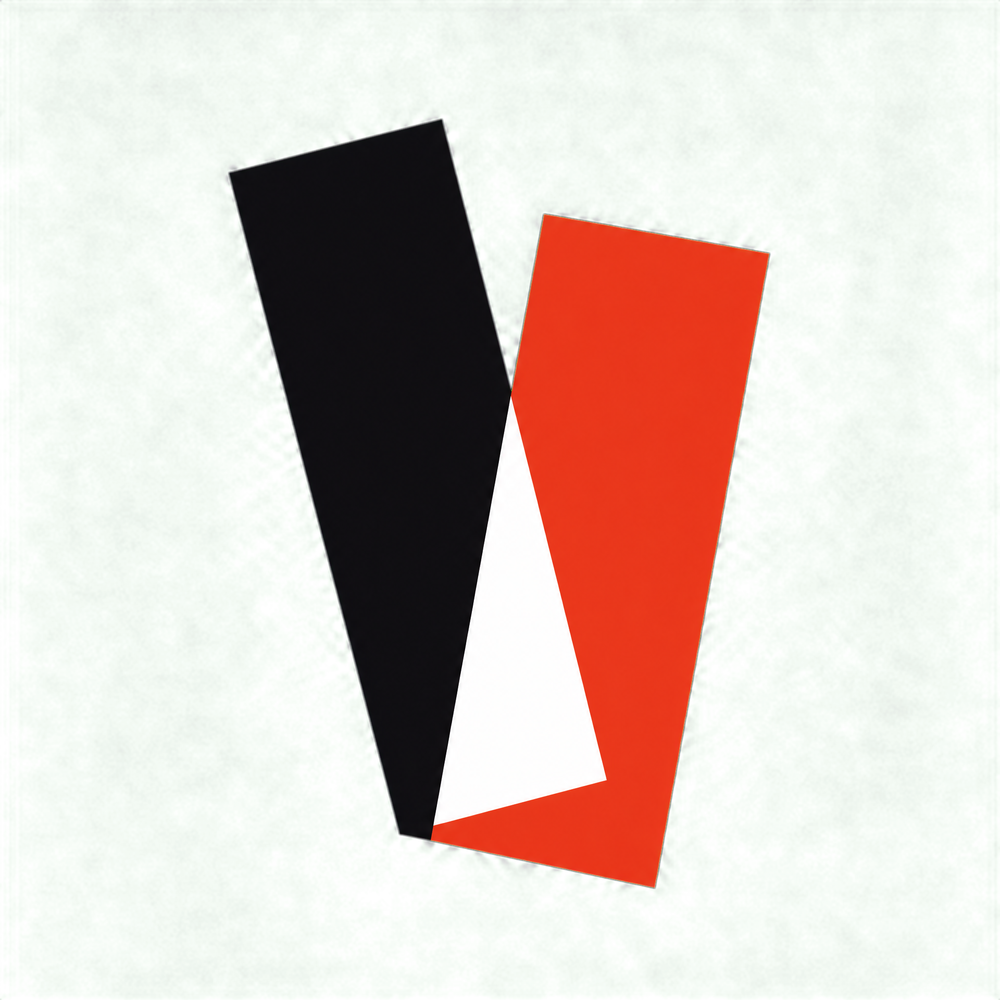
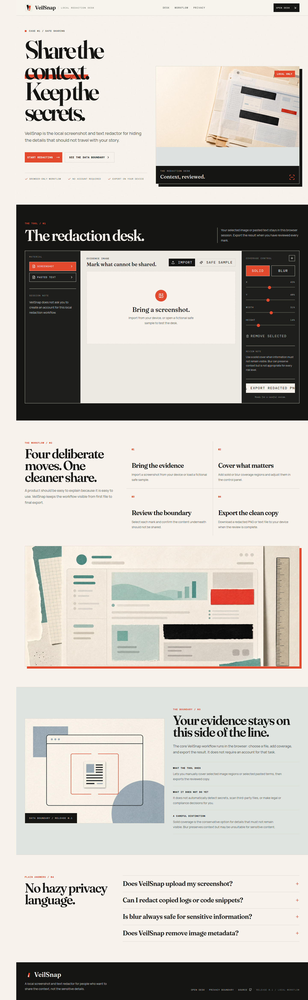
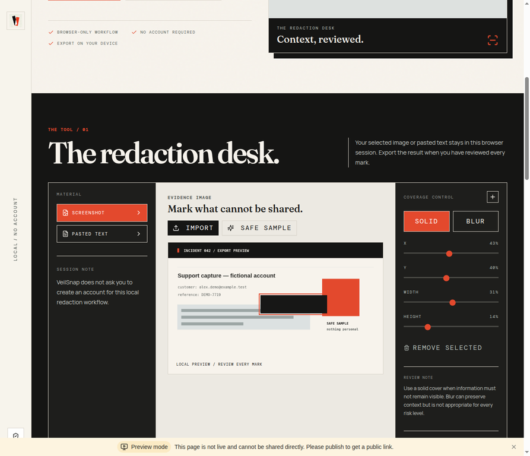
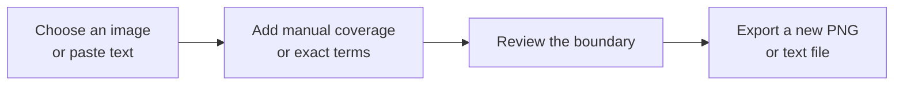

# VeilSnap

<p align="center">
  
</p>

<h3 align="center">Share the context. Keep the secrets.</h3>

<p align="center">
  <strong>A local screenshot and text redactor for people who need to share the useful part, not every detail around it.</strong>
</p>

<p align="center">
  <a href="#quick-start">Quick start</a> ·
  <a href="#what-you-can-do">Capabilities</a> ·
  <a href="#privacy-boundary">Privacy boundary</a> ·
  <a href="#contributing">Contributing</a>
</p>



> **The short version:** choose an image or paste text, add the coverage you need, review the result, and export a new copy from your browser.

## A redaction desk, not a generic editor

VeilSnap is designed for the awkward moment before you share a support capture, a bug report, a design review, a class note, or a copied log. It keeps the workflow deliberately narrow: **bring the evidence, cover what cannot travel, review the boundary, and export the cleaner copy.**

| Local image workflow | Exact-term text workflow | Clear trade-offs |
|---|---|---|
|  | Paste a log, snippet, or note; list the exact terms to cover; inspect the visual preview; and export a text file. | The interface explains when a solid cover is safer than blur and clearly states the first release’s limits. |

## What you can do



| Capability | How it works in 0.1 |
|---|---|
| **Screenshot coverage** | Add movable solid or blur regions to an image, then export a new PNG. |
| **Pasted-text coverage** | Enter exact comma-separated terms; VeilSnap replaces matching text in the preview and exported text file. |
| **Fictional safe sample** | Open a clearly fictional support capture to understand the desk without using personal information. |
| **Browser export** | Review first, then download the result to your device. |

## The product, in context

<p align="center">
  
  
</p>

The imagery is not a substitute for the product: the screenshots above show the working desk, while the editorial visuals make its purpose easy to understand at a glance. All displayed product examples are fictional.

## Privacy boundary


The core VeilSnap 0.1 workflow is browser-based: an image is displayed and exported in the browser, while pasted text is processed into a local preview and export. **No account is required for this core workflow.** This is a product-boundary statement, not a blanket security or compliance guarantee.

| VeilSnap does | VeilSnap does not claim to do |
|---|---|
| Let you manually cover selected image regions and exact pasted terms. | Automatically detect every secret, credential, or personal detail. |
| Let you choose a solid cover or a context-preserving blur. | Decide whether a specific workflow meets your organisation’s compliance requirements. |
| Export a new PNG or text file after you review it. | Remove image metadata in this first release. |
| Keep the core workflow free of an account requirement. | Make blur the conservative choice for every sensitive-data risk. |

> **Use a solid cover when content must not remain visible.** Blur may preserve visual context and may not be appropriate for every sensitive-data risk. Always inspect your exported copy before sharing.

## Quick start

VeilSnap is a static React application built with Vite, TypeScript, and Tailwind CSS.

```bash
npm install --global pnpm@10.15.1
pnpm install --frozen-lockfile
pnpm dev
```

Open the local address printed by Vite. Use the following commands before opening a pull request or cutting a release.

```bash
pnpm check
pnpm build
```

## Project map

| Location | Purpose |
|---|---|
| `client/src/pages/Home.tsx` | The visual product page and interactive redaction desk. |
| `client/public/images/` | Portable public images used by the site and README. |
| `.github/` | CI, Dependabot, issue forms, and pull-request guidance. |
| `docs/` | Brand rationale, research notes, and publication documentation. |
| `GITHUB_PUBLICATION_PACK.md` | Copy-and-paste GitHub Desktop, release, and repository-settings guide. |
| `ACHIEVEMENT_AND_COMMUNITY_PLAYBOOK.md` | Ethical project-community and achievement context. |

## Contributing

Useful contributions improve a real safe-sharing workflow, accessibility, documentation accuracy, or maintainability. Please read [CONTRIBUTING.md](CONTRIBUTING.md), [SECURITY.md](SECURITY.md), and the [Code of Conduct](CODE_OF_CONDUCT.md) before opening an issue or pull request.

Never include a real key, password, customer record, personal address, private log, or unredacted screenshot in a public issue, pull request, or example. Use fictional or safely anonymised content instead.

## Release notes and public-project materials

The [changelog](CHANGELOG.md) records product changes. The [GitHub Publication Pack](GITHUB_PUBLICATION_PACK.md) explains how to launch and configure the public repository. The [Achievement and Community Playbook](ACHIEVEMENT_AND_COMMUNITY_PLAYBOOK.md) explains what a public project can support — and what it cannot guarantee — in relation to GitHub achievements.

## License

VeilSnap is available under the [MIT License](LICENSE).
